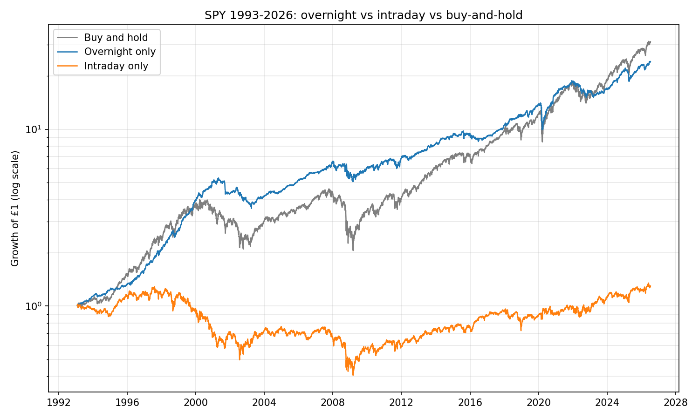
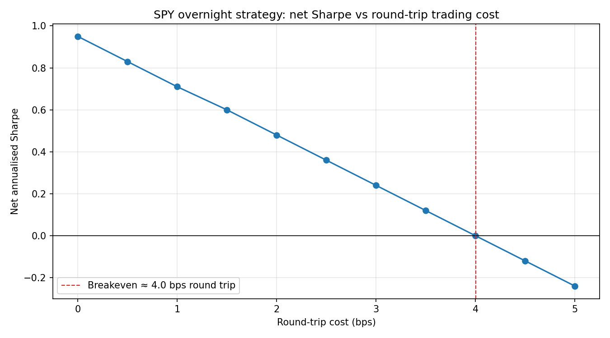

# The Overnight Puzzle: Decomposing Equity Returns

Nearly all of the US equity risk premium accrues **overnight** — between one day's close and the next day's open. The intraday session, the bit everyone actually watches, has earned roughly nothing for three decades. This repo replicates that finding on SPY, stress-tests it across sub-periods and other assets, and then does the part most write-ups skip: works out whether you can actually trade it.



Holding SPY **only overnight** (buy every close, sell every open) captured essentially all of buy-and-hold's growth since 1993, at roughly half the volatility. Holding it **only intraday** went nowhere.

## Headline results (SPY, Feb 1993 – Jul 2026, 8,419 trading days)

| Leg        | Annualised return | Annualised vol | Sharpe |
|------------|------------------:|---------------:|-------:|
| Overnight  | **+9.99%**        | 10.6%          | **0.95** |
| Intraday   | +0.78%            | 15.2%          | 0.13   |
| Buy & hold | +10.85%           | 18.6%          | 0.65   |

*Sharpe ratios assume a zero risk-free rate; returns are geometric annualised. Overnight = today's open ÷ yesterday's close − 1; intraday = today's close ÷ today's open − 1. The two legs compound to the full daily return.*

## Running it

```bash
pip install -r requirements.txt
python run_all.py
```

That downloads daily OHLC via yfinance (cached in `data/`), and rebuilds every figure in `figures/` and every table in `results/`. The narrative version with commentary is [notebooks/overnight_anomaly.ipynb](notebooks/overnight_anomaly.ipynb); the full write-up is [paper/overnight_anomaly.tex](paper/overnight_anomaly.tex).

## Method notes (the traps)

- **Dividends land in the overnight gap.** Mixing an adjusted close with an unadjusted open silently corrupts the decomposition. Everything here uses `auto_adjust=True`, so dividends and splits are folded into open *and* close consistently.
- **Stale opens.** If Yahoo prints an open equal to the previous close, the overnight return shows up as exactly zero. I checked: ~5.4% of days in the 1990s look stale, under 1.3% per decade since. Worth flagging; not big enough to overturn the picture.
- **Conventions.** Geometric annualised returns, √252 scaling, zero risk-free rate throughout.

## Stage 2 — Does it persist? Where does it die?

**Sub-periods (SPY):**

| Period | Overnight %/yr (Sharpe) | Intraday %/yr (Sharpe) |
|---|---:|---:|
| 1993–2009 | +11.3% (1.09) | −3.3% (−0.11) |
| 2010–2026 | +8.7% (0.82) | +5.1% (0.45) |
| 2020 crash (19 Feb–30 Apr) | −59.6% (−1.62) | +22.7% (0.79) |
| 2022 | −13.4% (−0.98) | −5.6% (−0.19) |

The effect is strongest pre-2010 — intraday was outright negative for seventeen years — and weakens afterwards. And it fails exactly when you'd want protection: gap-downs happen overnight, so the overnight leg took the 2020 crash and lost money through 2022. It carries the premium *and* the crashes.

**Other assets (full available history each):**

| Asset | From | Overnight %/yr (Sharpe) | Intraday %/yr (Sharpe) |
|---|---|---:|---:|
| SPY  | 1993 | +10.0% (0.95) | +0.8% (0.13) |
| QQQ  | 1999 | +13.9% (0.98) | −2.6% (−0.00) |
| AAPL | 1993 | +21.9% (0.91) | −0.0% (0.17) |
| MSFT | 1993 | +10.6% (0.67) | +6.5% (0.37) |
| JPM  | 1993 | +10.8% (0.63) | +2.4% (0.23) |
| GLD  | 2004 | +10.7% (0.85) | −0.3% (0.04) |

It refuses to die. Every asset tested earns more overnight than intraday — most extreme in QQQ and AAPL, narrowest in MSFT and JPM, and it even shows up in gold, which suggests this isn't purely an equity-risk-premium story.

## Stage 3 — Trade it honestly

The naive strategy is one round trip **per day** — about 252 a year — so each 1 bp of round-trip cost knocks ~2.5 percentage points off the annual return. Sweeping costs:

| Round-trip cost | Net return | Net Sharpe |
|---:|---:|---:|
| 0 bps | +10.0% | 0.95 |
| 1 bp  | +7.3%  | 0.71 |
| 2 bps | +4.6%  | 0.48 |
| 3 bps | +2.0%  | 0.24 |
| 4 bps | −0.6%  | 0.00 |
| 5 bps | −3.0%  | −0.24 |



**The anomaly survives only if round-trip costs are under ~4 bps.** SPY is about the cheapest instrument on earth (quoted spread ≈ 1 bp), but you cross it twice a day, every day, systematically buying at the close and selling at the open — precisely when everyone running this trade would. There is no realistic retail path under ~2 bps all-in; at that level you keep less than half the paper anomaly, and any slippage kills the rest. **Verdict: real anomaly, not an implementable strategy** — it's a fact about *when* the equity premium accrues, not a free lunch.

## Stage 4 — When is the overnight return biggest?

**After down days.** Bucketing tonight's overnight return by today's close-to-close move: ~8 bps after down days, decaying monotonically to **−7.4 bps after >2% up days** — a short-horizon reversal layered on the base effect.

**Around the Fed.** On scheduled FOMC announcement days (259 dates, 1994–2026, from the Fed's website — see `reference/`), the overnight return averages 13.4 bps vs 3.8 bps on ordinary days, and the intraday leg jumps to 11.2 bps vs 0.6 — consistent with the pre-FOMC drift of Lucca & Moench (2015), though 259 days is a small sample.

## Repo structure

```
overnight-anomaly/
├── run_all.py                    # end-to-end: data → figures/ + results/
├── src/
│   ├── data.py                   # yfinance download + local cache (auto-adjusted OHLC)
│   ├── returns.py                # decomposition + annualised stats
│   └── plots.py                  # all figures
├── notebooks/overnight_anomaly.ipynb   # narrative walkthrough, outputs included
├── reference/fomc_dates.csv      # scheduled FOMC announcement dates (federalreserve.gov)
├── figures/                      # committed PNGs
├── results/                      # CSV tables from run_all.py
└── paper/overnight_anomaly.tex   # working-paper write-up
```

## References

- Cooper, Cliff & Gulen (2008), *Return Differences between Trading and Non-trading Hours: Like Night and Day*, SSRN.
- Lou, Polk & Skouras (2019), *A Tug of War: Overnight versus Intraday Expected Returns*, JFE.
- Hendershott, Livdan & Rösch (2020), *Asset Pricing: A Tale of Night and Day*, JFE.
- Lucca & Moench (2015), *The Pre-FOMC Announcement Drift*, JF.
